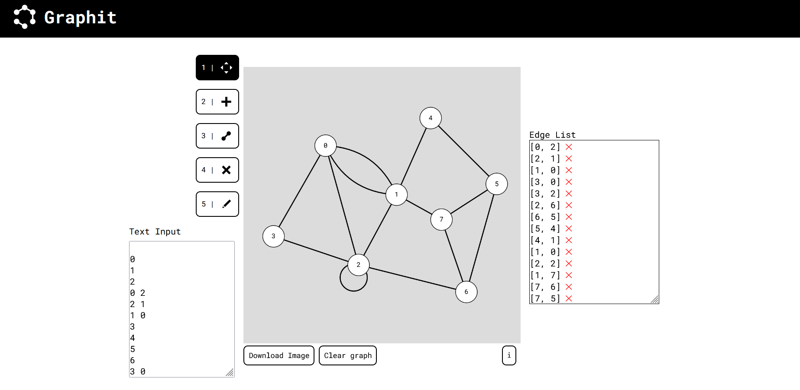

<h1 align="center">
   
  
   
  Graphit
   
</h1>

<h4 align="center">A simple, lightweight web-based graph editor for those who can't wait to start graphing. Powered by <a href="https://p5js.org" target="_blank">p5.js</a></h4>

  <a href="#key-features">Key Features</a> •
  <a href="#how-to-use">How To Use</a> •
  <a href="#roadmap">Roadmap</a> •
  <a href="#credits">Credits</a> •
  <a href="#license">License</a>

## Key Features

* Easy and intuitive creation and deletion of nodes, edges, and drawings
* Supports uni and bidirectional, weighted and unweighted edges, multiedges, self-loops
* Text input with competitive programming formatting: import graph information faster
* Edge list visualisation
* Download image with graph and annotations (easy way to generate graph theory visuals!)
 
## How To Use

Simply access [erickcpassos.github.io/graphit](https://erickcpassos.github.io/graphit/) and follow the (really friendly) introductory tutorial. 

## Roadmap

These are some of the functions that will make Graphit even better!

- [x] Visible self-loops
- [x] Download graph image
- [x] Multiple values on edges
- [x] Multiedges visibly separated
- [x] Draw with pencil on top of the graph (does not affect nodes and edges)
- [ ] Colors in nodes and edges
- [ ] Easily create known graphs such as K_n or ring_n
- [ ] Color graph with <= n colors, show Eulerian/Hamiltonian path
- [ ] Additional data structure visualisations (adjacency list, adjacency matrix)
- [ ] Add values to nods

## Credits

This software uses the following open source packages:

- [p5.js](https://p5js.org/)
- [Node.js](https://nodejs.org/)

## License

MIT

---

> [erickcpassos.github.io](https://erickcpassos.github.io/website) &nbsp;&middot;&nbsp;
> GitHub [@erickcpassos](https://github.com/erickcpassos)
